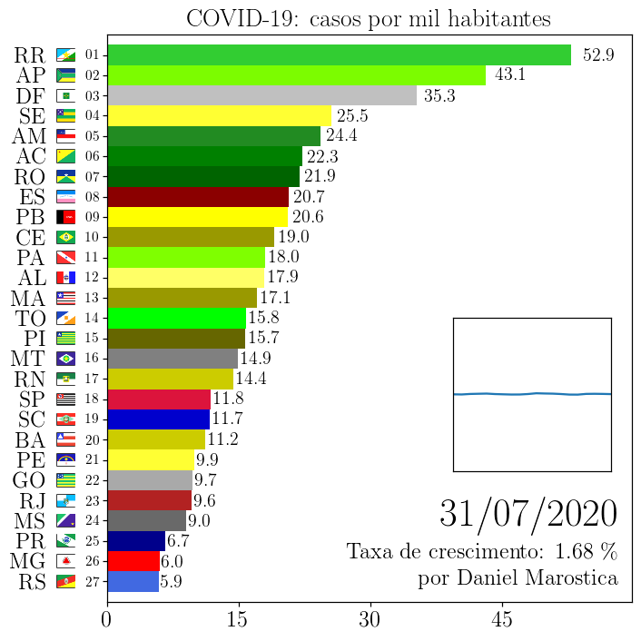

# COVID-19 - Animação da evolução dos casos da doença no Brasil, por estado

## Instruções
- Faça download dos dados em https://covid.saude.gov.br;
- Salve o arquivo .xlsx como `arquivo_geral.csv` (o desempenho é muito superior ao importar dados nesse formato) no diretório deste script;
A animação .gif será gerada automaticamente.

## Requer 
- Python 3.5+
- ImageMagick

 </img> 

